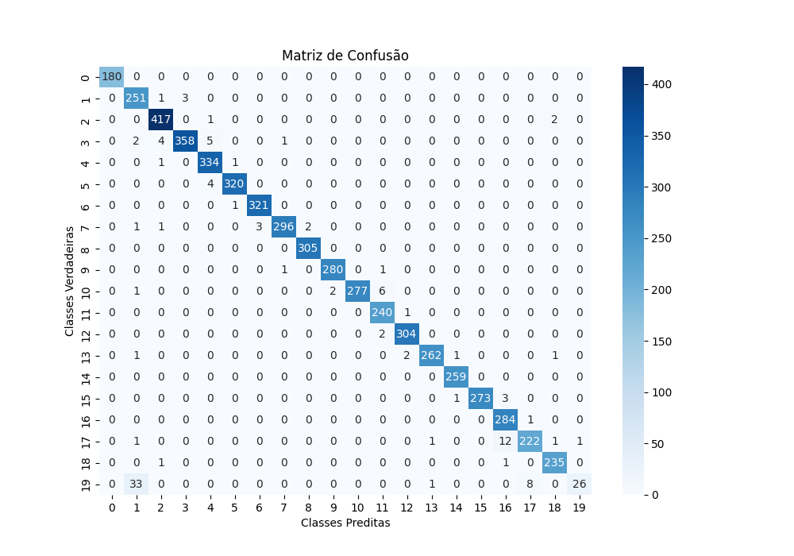

# Robotic Grasp Detection with Deep Convolutional Neural Networks 🤖

# Introduction

In this project, Deep Convolutional Neural Networks (DCNNs) is used to simultanously detect a grasping point and angle of an object, so that a robot arm can pick the object. In general, this is the implementation of a small model of the model presented in this paper https://arxiv.org/abs/1802.00520. I used the DL model Wide Resnet 101_2 for the regression and classification training.

Loss: 3.772731165262474

Acurácia: 0.9790

Precisão: 0.9783

Recall: 0.9560

F1-Score: 0.9606

Matriz de Confusão:



## Dependencies

- python 3.6.8
- pytorch 1.10.0

## Creation of the virtual environment through Anaconda

- In the terminal run

```
conda create -n venv-robotic-grasp python==3.6.8
```

- After creating the environment, run the command below to activate the environment:

```
conda activate venv-robotic-grasp
```

- Run the requirements.txt:

```
pip install -r requirements.txt
```

## Codes

1. Data preprocessing
2. Training
3. Demo
4. Evaluate

### 1. Data preprocessing

- Download [Cornell Dataset](https://www.kaggle.com/datasets/oneoneliu/cornell-grasp)
- Put in the folder `./dataset/cornell`
- Run `dataPreprocessingTest_fasterrcnn_split.m` (please modify paths according to your structure)

### 2. Training

```
python train.py --epochs 100 --lr 0.0001 --batch-size 8
```

### 3. Demo

- Download the pretrained model [OneDrive](https://cinufpe-my.sharepoint.com/personal/eq_tecnica_softex_cin_ufpe_br/_layouts/15/onedrive.aspx?ga=1&id=%2Fpersonal%2Feq%5Ftecnica%5Fsoftex%5Fcin%5Fufpe%5Fbr%2FDocuments%2FTCCs%20Residentes%202023%2Fkaroline%5Fsilva%2Fweights)
<!-- - Download the pretrained model [Google Drive](https://drive.google.com/file/d/14WJXHpu5eSzzy299qf764q8J1Zj-DIyM/view?usp=sharing) -->
- Put in the folder `./models`
- Run demo:

```
python demo.py
```

### 4. Evaluate

- Run evaluate:

```
python evaluate.py
```

## Acknowledgment

This repo borrows some of code from
https://github.com/ivalab/grasp_multiObject_multiGrasp

## Tools

<p align="left"> <a href="https://matplotlib.org/" target="_blank" rel="noreferrer">  </a> <a href="https://numpy.org/" target="_blank" rel="noreferrer">  </a> <a href="https://opencv.org/" target="_blank" rel="noreferrer">  </a> <a href="https://www.python.org/" target="_blank" rel="noreferrer">  </a> <a href="https://scikit-image.org/" target="_blank" rel="noreferrer">  </a> <a href="https://scipy.org/" target="_blank" rel="noreferrer">  </a> <a href="https://pytorch.org/" target="_blank" rel="noreferrer">  </a> <a href="https://seaborn.pydata.org/installing.html" target="_blank" rel="noreferrer">  </a> <a href="https://scikit-learn.org/stable/" target="_blank" rel="noreferrer">  </a> <a href="https://anaconda.org/anaconda/python" target="_blank" rel="noreferrer">  </a> </p>
